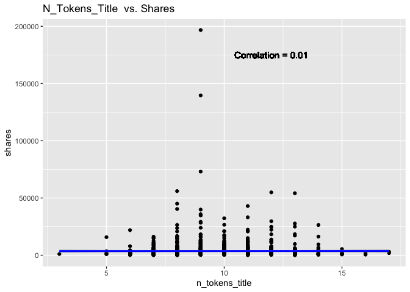
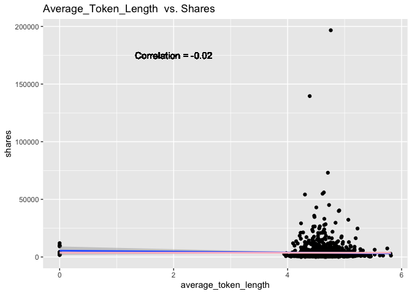
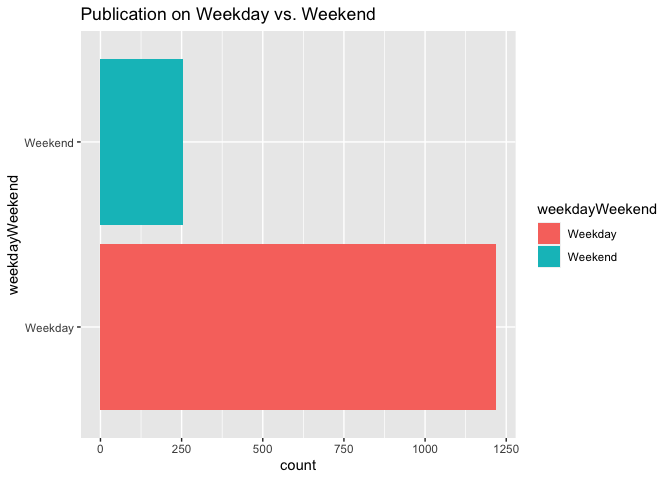
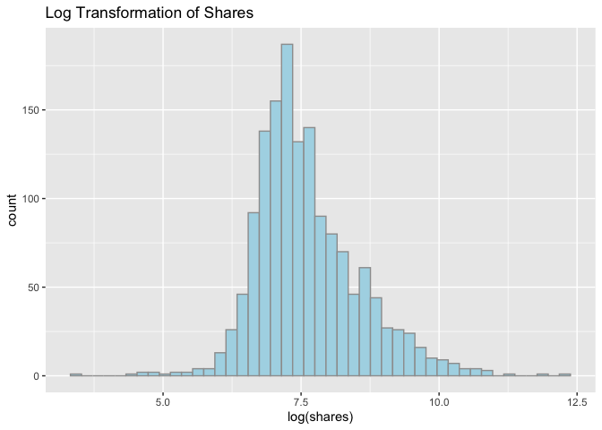
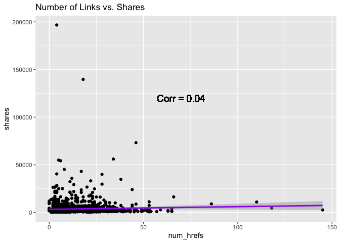
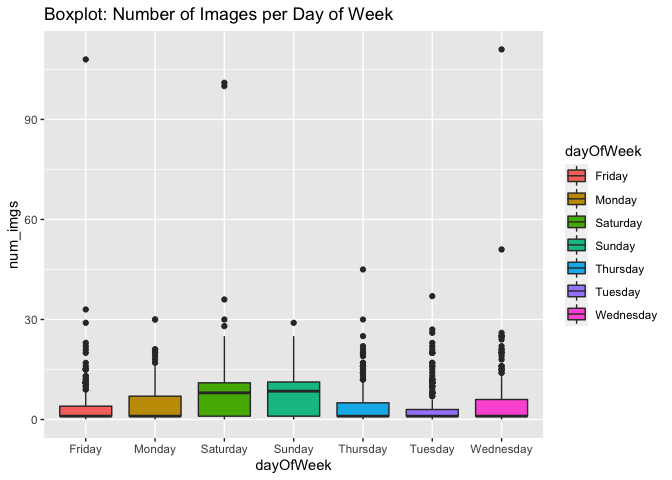

Project2McKeonSnyder
================
Owen Snyder and Ashlee McKeon
2022-07-05

-   [Introduction](#introduction)
    -   [Our Goal and Purpose](#our-goal-and-purpose)
    -   [Variable Selection](#variable-selection)
    -   [Methods](#methods)
    -   [Packages](#packages)
    -   [Automation Code](#automation-code)
-   [Read in Data](#read-in-data)
-   [Create New Variables](#create-new-variables)
    -   [Filter Data by Channel](#filter-data-by-channel)
-   [Split Data: Train/Test Set](#split-data-traintest-set)
-   [Numerical Summaries](#numerical-summaries)
-   [Contingency Tables](#contingency-tables)
-   [Plots](#plots)
    -   [Plot 1 - Scatterplot](#plot-1---scatterplot)
    -   [Plot 2 - Scatterplot](#plot-2---scatterplot)
    -   [Plot 3 - Barplot](#plot-3---barplot)
    -   [Plot 4 - Histogram](#plot-4---histogram)
    -   [Plot 5 - Scatterplot](#plot-5---scatterplot)
    -   [Plot 6 - Boxplot](#plot-6---boxplot)
-   [Modeling](#modeling)
    -   [Linear Model 1 - Full Linear
        Model](#linear-model-1---full-linear-model)
    -   [Linear Model 2 - Polynomial
        Regression](#linear-model-2---polynomial-regression)
    -   [Ensemble 1 - Random Forest](#ensemble-1---random-forest)
    -   [Ensemble 2 - Boosted Tree](#ensemble-2---boosted-tree)
-   [Model Comparison](#model-comparison)

Render Function

``` r
rmarkdown::render("Project2McKeonSnyder.Rmd",
                  output_format = "github_document",
                  output_file = "READmeFinal.md",
                  params = list(dataChannel = "Lifestyle"),
                  output_options = list(
                    html_preview = FALSE, toc = TRUE, toc_depth = 2, toc_float = TRUE)
)
```

# Introduction

This is a full report of Project 2 conducted by Ashlee McKeon and Owen
Snyder.

## Our Goal and Purpose

The main goal of this project is to create predictive models based on
data from an [online news popularity
site](https://archive.ics.uci.edu/ml/datasets/Online+News+Popularity).
The data includes about two years worth of information regarding
*Mashable* articles. This data is summarized by a set of 61 categorical
and quantitative variables that will eventually help us predict the
number of shares a *Mashable* article gets. We will only use a subset of
these variables to help predict the shares variable using a variety of
predictive models such as Linear models, a Random Forest, and a Boosted
Tree model. Before the models are fitted, we will split the data into a
training and test set (70/30 split) and there will be an exploratory
data analysis conducted. Once the models are fitted, we will use the
RMSE metric to determine which model has the lowest RMSE and thus
declared the winner for that data channel.

## Variable Selection

Because of the large variety of variables this data set includes, we
decided to only consider a subset of the variables to work with.
However, it is important to note one specific set of variables we will
be basing our analysis on. We will be starting with the
*data_channel_is\_* \* variables to see if they have any relation to the
number of shares and the rest of the variables we select.

The following our are variables of interest:

-   **shares** - Number of shares (this is our target variable!)
-   **n_tokens_title** - Number of words in the title
-   **average_token_length** - Average length of the words in the
    content
-   **global_rate_positive_words** - Rate of positive words in the
    content
-   **global_rate_negative_words** - Rate of negative words in the
    content
-   **num_imgs** - Number of images
-   **num_videos** - Number of videos
-   **num_hrefs** - Number of links

For categorical variables, we will be using the following variables. In
fact, we will be combining the days of the week into one variable called
**dayOfWeek** and the method of its creation will be described as it
arises.

-   **weekday_is_monday** - Was the article published on a Monday?
-   **weekday_is_tuesday** - Was the article published on a Tuesday?
-   **weekday_is_wednesday** - Was the article published on a Wednesday?
-   **weekday_is_thursday** - Was the article published on a Thursday?
-   **weekday_is_friday** - Was the article published on a Friday?
-   **weekday_is_saturday** - Was the article published on a Saturday?
-   **weekday_is_sunday** - Was the article published on a Sunday?

Finally, the six data channels we will be working with come from these
key variables. Also, note that we have created one variable to represent
each data channel named **dataChannel**. Its method of creation will
also be described below as it arises.

-   **data_channel_is_lifestyle** - Is data channel ‘Lifestyle’?
-   **data_channel_is_entertainment** - Is data channel ‘Entertainment’?
-   **data_channel_is_bus** - Is data channel ‘Business’?
-   **data_channel_is_socmed** - Is data channel ‘Social Media’?
-   **data_channel_is_tech** - Is data channel ‘Tech’?
-   **data_channel_is_world** - Is data channel ‘World’?

## Methods

Before we get started, it is important to briefly describe the methods
we used for analysis.

-   We will first read in the data set and manipulate the necessary
    variables.
-   The data will be separated into a training and test set. This will
    be a 70/30 split.
-   We will include some contingency tables at each setting of our
    categorical variables to get a better idea of the data at hand. We
    will also include summary statistics for quantitative variables. The
    data for these summaries will be used via the *training* data.
-   We will include a variety of graphs to better visualize our data.
    These graphs will be described in a more subjective manner so that
    automation of each setting of this report makes more sense. We will
    still be using the *training* data.
-   Finally, we will be using machine learning methods via Random
    Forrest Boosted Tree models. These models will be explained in
    greater detail in their respective section.

## Packages

Below is a list of necessary packages that will aid our data analysis
and modeling.

-   `tidyverse` is a collection of useful packages designed for data
    science.
-   `ggplot2` is an amazing way to create visually pleasing and
    informative graphics.
-   `caret` is a set of functions that streamline the process of
    implementing machine learning methods.
-   `rmarkdown` is a useful package for creating R Markdown documents in
    a variety of formats.
-   `knitr` is a useful package to integrate computing and reporting.

``` r
library(tidyverse)
library(ggplot2)
library(caret)
library(rmarkdown)
library(knitr)
```

## Automation Code

``` r
## create dataChannel object to store all channels
dataChannel <- c("Business", "Entertainment", "Lifestyle", "Social Media", "Tech", "World")
## use lapply()
params <- lapply(dataChannel, FUN= function(x){list(dataChannel=x)})
## create output file names
output_file <-  paste0(dataChannel, ".md")
## put into a tibble
reports <- tibble(output_file, params)
## now apply to all
apply(reports, MARGIN = 1,
      FUN=function(x){  
  rmarkdown::render("Project2McKeonSnyder.Rmd",
                     output_format = "github_document",
                     output_file = x[[1]],
                     params = x[[2]])})
```

# Read in Data

``` r
setwd("~/Desktop")
newsData <- read_csv("OnlineNewsPopularity.csv")
newsData
```

# Create New Variables

Because we are working with six different channels across six different
columns of data, we figured it would be easier to combine every channel
into one column. That way, we will be working with one single channel
variable that takes on unique values of Lifestyle, Entertainment,
Business, Social Media, Tech, and World. This will make automation and
analysis more clear. Note that the original data tells us that a data
for either channel is 1 or 0.

``` r
## use mutate() to create a new channel variable
newsData <- newsData %>% mutate(dataChannel = 
                              ifelse(data_channel_is_bus==1, "Business",
                              ifelse(data_channel_is_entertainment==1, "Entertainment",
                              ifelse(data_channel_is_lifestyle==1, "Lifestyle",
                              ifelse(data_channel_is_socmed==1, "Social Media",
                              ifelse(data_channel_is_tech==1, "Tech",
                              ifelse(data_channel_is_world==1, "World", "Other"))))))) %>%
                      mutate(dayOfWeek = 
                               ifelse(weekday_is_monday==1, "Monday",
                               ifelse(weekday_is_tuesday==1, "Tuesday",
                               ifelse(weekday_is_wednesday==1, "Wednesday",
                               ifelse(weekday_is_thursday==1, "Thursday",
                               ifelse(weekday_is_friday==1, "Friday",
                               ifelse(weekday_is_saturday==1, "Saturday",
                               ifelse(weekday_is_sunday==1, "Sunday", "NULL")))))))) %>%
                      mutate(weekdayWeekend = 
                               ifelse(weekday_is_monday==1, "Weekday",
                               ifelse(weekday_is_tuesday==1, "Weekday",
                               ifelse(weekday_is_wednesday==1, "Weekday",
                               ifelse(weekday_is_thursday==1, "Weekday",
                               ifelse(weekday_is_friday==1, "Weekday",
                               ifelse(weekday_is_saturday==1, "Weekend",
                               ifelse(weekday_is_sunday==1, "Weekend", "NULL"))))))))

## Upon inspection, there are NA values present, this could be due to some articles not having
## one of these specific categories. Thus, we set all NA values for dataChannel to be "Other".
## However, "Other" will not be analyzed.
```

## Filter Data by Channel

Here, we can filter the data by each specific data channel. This will
become helpful upon automation.

``` r
newsData.busn <- newsData %>% filter(dataChannel=="Business")
newsData.ent <- newsData %>% filter(dataChannel=="Entertainment")
newsData.life <- newsData %>% filter(dataChannel=="Lifestyle")
newsData.socmed <- newsData %>% filter(dataChannel=="Social Media")
newsData.tech <- newsData %>% filter(dataChannel=="Tech")
newsData.wrld <- newsData %>% filter(dataChannel=="World")

## create new data set for use via automating different reports.
## note the params$dataChannel argument
channel.data <- newsData %>% filter(dataChannel == params$dataChannel)
```

# Split Data: Train/Test Set

In this section we will split our `channel.data` into a training and
test set. The training set will be used for model fitting and EDA while
the test set will be used for predictions/model comparisons. This will
be a 70/30 split.

``` r
set.seed(558) ## set seed for reproducibility
## set train index
trainIndex <- createDataPartition(channel.data$shares, p = 0.70, list = FALSE)
## training data
newsTrain <- channel.data[trainIndex, ]
## test data
newsTest <- channel.data[-trainIndex, ]
```

# Numerical Summaries

This section is dedicated to creating basic summary statistics for our
response variables, **shares**. Before performing more in depth analysis
and modeling, it is important to get a better idea of how our data is
distributed. For example, one should take note of means, median, and
standard deviations. Another aspect to note is that if the median is
greater than the mean then our data is likely skewed to the left.
Conversely, if the median is less than the mean, the data is likely
skewed to the right.

``` r
newsTrain %>% summarise(avgShares = mean(shares), medianShares = median(shares), sdShares = sd(shares))
```

# Contingency Tables

Next, we may want to look at the frequency of all data channels in the
newsData dataset.

``` r
oneWayDataChannel <- table(newsData$dataChannel)
oneWayDataChannel 
```

    ## 
    ##      Business Entertainment     Lifestyle         Other  Social Media          Tech         World 
    ##          6258          7057          2099          6134          2323          7346          8427

We can see from the table that Tech and World are the most common, while
Lifestyle and Social Media are the least common. This may suggest
something meaningful exists here to look into more.

Considering different data channels may be published more commonly on
specific days of the week (e.g., business articles potentially having a
higher publication frequency Monday through Friday compared to Saturday
through Sunday). A two-way contingency table can be run to see if that
theory holds up at the summary level of analysis.

``` r
twoWayChannelDays <- table(newsData$dataChannel, newsData$dayOfWeek) 
twoWayChannelDays
```

    ##                
    ##                 Friday Monday Saturday Sunday Thursday Tuesday Wednesday
    ##   Business         832   1153      243    343     1234    1182      1271
    ##   Entertainment    972   1358      380    536     1231    1285      1295
    ##   Lifestyle        305    322      182    210      358     334       388
    ##   Other            966    900      424    548     1102    1111      1083
    ##   Social Media     332    337      180    137      463     458       416
    ##   Tech             989   1235      525    396     1310    1474      1417
    ##   World           1305   1356      519    567     1569    1546      1565

It does appear from the table that publication frequency is much higher
Monday through Friday compared to Saturday through Sunday, and that this
pattern is stable across all data channels.

# Plots

This section is dedicated to visualization by means of the `ggplot2`
package. We will be analyzing how the shares variables interacts with
various predictor variables via plots.

## Plot 1 - Scatterplot

We first want to visually examine if there is relationship between title
length and the amount of times an article is shared.

``` r
correlation1 <- cor(newsData$n_tokens_title, newsData$shares)

scatterplotTitle <- ggplot(newsTrain, aes(x= `n_tokens_title`, y= `shares`)) +
  geom_point() +
  labs(title= "N_Tokens_Title  vs. Shares") + 
  geom_smooth(method = 'lm') +
  geom_smooth(col = "blue") +
  geom_text(x = 12, y = 175000, size = 4, label = paste0("Correlation = ", round(correlation1, 2)))
scatterplotTitle
```

<!-- -->

## Plot 2 - Scatterplot

What if now we are interested in determining if there is relationship
between content length and the amount of times an article is shared.

``` r
correlation2 <- cor(newsData$average_token_length, newsData$shares)

scatterplotLength <- ggplot(newsTrain, aes(x= `average_token_length`, y= `shares`)) +
  geom_point() +
  labs(title= "Average_Token_Length  vs. Shares") + 
  geom_smooth(method = 'lm') +
  geom_smooth(col = "pink") +
  geom_text(x = 2, y = 175000, size = 4, label = paste0("Correlation = ", round(correlation2, 2)))
scatterplotLength
```

<!-- -->

## Plot 3 - Barplot

We can use a bar graph to determine if any data channels are published
more on weekdays than on weekends.

``` r
barplotDay <- ggplot(data = newsTrain, aes(y= `weekdayWeekend`, fill = weekdayWeekend))
barplotDay + geom_bar() + 
  labs(title= "Publication on Weekday vs. Weekend")
```

<!-- -->

We can see from the plot that there is a very apparent difference
between the number of articles published on weekdays vs. weekends, with
articles published on weekdays being much higher.

## Plot 4 - Histogram

This is a histogram of the shares variable. We wanted to get a better
idea of how this response variable is distributed and figured it was
best to transform the data via a log transformation. This method is
useful when dealing with skewed data and can make the data more
interpretable. When looking at this plot, we hope to see a fairly Normal
distribution.

``` r
hist.shares <- ggplot(data = newsTrain, aes(x = log(shares)))
hist.shares + geom_histogram(bins = 45, fill = "lightblue", colour = 8) +
              ggtitle("Log Transformation of Shares")
```

<!-- -->

## Plot 5 - Scatterplot

Next we will plot the number of links versus the number of shares. This
will be done via a scatterplot because this will be able to give us a
better visual of how these data are represented and if they are
associated with one another. When looking at this plot, one should take
note of a positive or negative correlation. For example, if we see a
positive correlation, we can suggest that articles with a greater number
of links tend to be shared more.

``` r
## First, find correlation to plot on graph
correlation3 <- cor(newsTrain$num_hrefs, newsTrain$shares) 
sp1 <- ggplot(data = newsTrain, aes(x = num_hrefs, y = shares))
sp1 + geom_point() + geom_smooth(method = "lm", col = "purple") +
  ggtitle("Number of Links vs. Shares") +
  geom_text(x = 70, y = 120000, size = 5, label = paste0("Corr = ", round(correlation3,2)))
```

<!-- -->

## Plot 6 - Boxplot

Below is a boxplot that assesses the number of images based on each day
of the week. These plots will give us a better representation of how our
data is distributed per each day of the week. One should take note of
any outliers and/or skewness that is present and be able to identify the
median.

NOTE! Outliers may heavily influence these boxplots.

``` r
bp1 <- ggplot(data = newsTrain, aes(x=dayOfWeek, y=num_imgs, fill=dayOfWeek))
bp1 + geom_boxplot() + ggtitle("Boxplot: Number of Images per Day of Week")
```

<!-- -->

# Modeling

The main goal of our modeling section is to create predictive models for
predicting the number of shares based on our variables of interest. We
will be using two linear regression type models and two ensemble
tree-based models. Once these models are fit, we will be able to
identify the best of the four.

First, it is important to describe in detail the methods behind each of
these model types.

**Linear Models** – Linear models are a method for predictive modeling
that allows for evaluating the linear relationship between a continuous
outcome variable of interest against one or more predictor variables.
With linear models you are evaluating one model at a time, and can
compare that model to other models of interest to determine best fit for
the data. Linear regression and multiple linear regression are both
examples of linear models.

**Ensemble Models** – Ensemble models are a method for taking multiple
independent and different models and combining those models into one
stronger model for prediction. This method can produce stronger
prediction results when compared to linear models due to it’s enhanced
ability to reduce generalized error. Random Forest and Boosted Trees are
both examples of ensemble models.

## Linear Model 1 - Full Linear Model

**Full Linear Model**: Using all of our variables of interest. We first
wanted to see how well a full linear model would fit when using our
predictors to asses the number of shares. From this first model, each
additional model we make will become more complex.

``` r
## set up trainControl using 5-fold cross validation
trnCntrl <- trainControl(method = "cv", number=5)
## NewtrnCntrl for ENSEMBLE METHODS
NewtrnCntrl <- trainControl(method = "cv", number=5, repeats=3)
```

    ## Warning: `repeats` has no meaning for this resampling method.

``` r
## now fit linear model for our chosen predictors
lmFit1 <- train(shares ~ n_tokens_title + average_token_length + global_rate_positive_words +
                         global_rate_negative_words + num_imgs + num_videos + num_hrefs,
                data = newsTrain,
                method = "lm",
                trControl = trnCntrl,
                preProcess = c("center", "scale"))

## print model 
lmFit1
```

    ## Linear Regression 
    ## 
    ## 1472 samples
    ##    7 predictor
    ## 
    ## Pre-processing: centered (7), scaled (7) 
    ## Resampling: Cross-Validated (5 fold) 
    ## Summary of sample sizes: 1178, 1177, 1180, 1177, 1176 
    ## Resampling results:
    ## 
    ##   RMSE      Rsquared     MAE     
    ##   7844.875  0.004304763  3287.255
    ## 
    ## Tuning parameter 'intercept' was held constant at a value of TRUE

``` r
## Now predict on the TEST data!
lmFit1.pred <- predict(lmFit1, newdata = newsTest)
```

## Linear Model 2 - Polynomial Regression

**Linear Model - Polynomial Regression**: Extending the linear
regression model above but including higher order terms by squaring all
predictors in the model.

``` r
lmFit2 <- train(shares ~ I(n_tokens_title^2) + I(average_token_length^2) + 
                         I(global_rate_positive_words^2) +I(global_rate_negative_words^2) + 
                         I(num_imgs^2) + I(num_videos^2) + I(num_hrefs^2),
                data = newsTrain,
                method = "lm",
                preProcess = c("center", "scale"),
                trControl = trnCntrl)

## print model 
lmFit2
```

    ## Linear Regression 
    ## 
    ## 1472 samples
    ##    7 predictor
    ## 
    ## Pre-processing: centered (7), scaled (7) 
    ## Resampling: Cross-Validated (5 fold) 
    ## Summary of sample sizes: 1177, 1179, 1177, 1177, 1178 
    ## Resampling results:
    ## 
    ##   RMSE      Rsquared     MAE     
    ##   13945.24  0.001337606  3770.275
    ## 
    ## Tuning parameter 'intercept' was held constant at a value of TRUE

``` r
## Now predict on the TEST data!
lmFit2.pred <- predict(lmFit2, newdata = newsTest)
```

## Ensemble 1 - Random Forest

**Random Forest Model**: This is a random forest model using all
variables we have selected for analysis as predictors. Note that we are
using `mtry=1:5`where `mtry` is a tuning parameter for the number of
randomly selected predictors.

``` r
rfFit <- train(shares ~ n_tokens_title + average_token_length + global_rate_positive_words +
                         global_rate_negative_words + num_imgs + num_videos + num_hrefs,
                  data = newsTrain,
                  method = "rf",
                  trControl = NewtrnCntrl,
                  preProcess = c("center", "scale"),
                  tuneGrid = data.frame(mtry= 1:5))

## print model 
rfFit
```

    ## Random Forest 
    ## 
    ## 1472 samples
    ##    7 predictor
    ## 
    ## Pre-processing: centered (7), scaled (7) 
    ## Resampling: Cross-Validated (5 fold) 
    ## Summary of sample sizes: 1177, 1178, 1177, 1178, 1178 
    ## Resampling results across tuning parameters:
    ## 
    ##   mtry  RMSE      Rsquared     MAE     
    ##   1     7510.391  0.007825667  3262.997
    ##   2     7668.288  0.005315095  3347.367
    ##   3     7872.844  0.004014322  3431.127
    ##   4     8061.319  0.003923640  3476.012
    ##   5     8170.469  0.003524707  3506.216
    ## 
    ## RMSE was used to select the optimal model using the smallest value.
    ## The final value used for the model was mtry = 1.

``` r
## Now predict on the TEST data!
rfFit.pred <- predict(rfFit, newdata = newsTest)
```

## Ensemble 2 - Boosted Tree

**Boosted Tree Model**: This is a boosted tree model using all variables
we have selected for analysis as predictors. We are first creating an
object `gbmGrid` which includes varying arguments. First,
`interaction.depth` is set to establish the maximum tree depth. Next,
`n.trees` is setting the number of boosting iterations. The `shrinkage`
argument is setting a shrinkage value and lastly, the `n.minobsinnode`
argument sets the minimum terminal node sizes.

``` r
## set a grid of parameters for our Boosted Tree Model
gbmGrid <-  expand.grid(interaction.depth = c(1,2,3,4), 
                        n.trees = c(50,100,150,200), 
                        shrinkage = 0.1,
                        n.minobsinnode = 10)

boostFit <- train(shares ~ n_tokens_title + average_token_length + global_rate_positive_words +
                         global_rate_negative_words + num_imgs + num_videos + num_hrefs,
                  data = newsTrain,
                  method = "gbm",
                  trControl = NewtrnCntrl,
                  preProcess = c("center", "scale"),
                  tuneGrid = gbmGrid,
                  verbose = FALSE)

## print model
boostFit
```

    ## Stochastic Gradient Boosting 
    ## 
    ## 1472 samples
    ##    7 predictor
    ## 
    ## Pre-processing: centered (7), scaled (7) 
    ## Resampling: Cross-Validated (5 fold) 
    ## Summary of sample sizes: 1178, 1178, 1178, 1177, 1177 
    ## Resampling results across tuning parameters:
    ## 
    ##   interaction.depth  n.trees  RMSE      Rsquared     MAE     
    ##   1                   50      7840.318  0.014483561  3312.728
    ##   1                  100      7834.560  0.016199525  3328.946
    ##   1                  150      7858.220  0.009631089  3289.617
    ##   1                  200      7836.751  0.006010009  3282.375
    ##   2                   50      7872.319  0.012205607  3318.403
    ##   2                  100      7851.089  0.005911130  3314.017
    ##   2                  150      7898.734  0.002608779  3328.601
    ##   2                  200      7967.227  0.001915455  3357.738
    ##   3                   50      7882.633  0.005012197  3314.264
    ##   3                  100      8026.152  0.003213168  3386.804
    ##   3                  150      8166.095  0.002288559  3513.835
    ##   3                  200      8172.084  0.003020428  3578.122
    ##   4                   50      7886.029  0.016815656  3315.103
    ##   4                  100      8053.739  0.005628452  3471.359
    ##   4                  150      8181.416  0.005564406  3565.702
    ##   4                  200      8273.670  0.003837138  3658.510
    ## 
    ## Tuning parameter 'shrinkage' was held constant at a value of 0.1
    ## Tuning parameter 'n.minobsinnode'
    ##  was held constant at a value of 10
    ## RMSE was used to select the optimal model using the smallest value.
    ## The final values used for the model were n.trees = 100, interaction.depth = 1, shrinkage = 0.1
    ##  and n.minobsinnode = 10.

``` r
## Now predict on the TEST data!
boostFitPred <- predict(boostFit, newdata = newsTest)
```

# Model Comparison

There are many different metrics that can be utilized to determine which
model should be used. For example, popular metrics include MAE, RMSE,
AIC/BIC, and many more.

This section will be dedicated to comparing our models via the RMSE
metric only.

We will be using the `predict()` function that we used above after
fitting each of the models, along with base R functions like `sqrt()`
and `mean()` to calculate RMSE by hand.

``` r
## Find RMSE for Full Linear model (lmFit1)
lmFit1.RMSE <- sqrt(mean((lmFit1.pred-newsTest$shares)^2))

## Find RMSE for Polynomial Regression (lmFit2)
lmFit2.RMSE <- sqrt(mean((lmFit2.pred-newsTest$shares)^2))

## Find RMSE for Random Forest model (rfFit)
rfFit.RMSE <- sqrt(mean((rfFit.pred-newsTest$shares)^2))

## Find RMSE for Boosted Tree model (boostFit)
boostFit.RMSE <- sqrt(mean((boostFitPred-newsTest$shares)^2))
```

Now we can create a table of all of the RMSE values to get a better
visual of how these values differ among model fits. We will also
calculate the minimum RMSE to set up the automation for the best model.

``` r
## create data frame of all RMSE values 
all.RMSE <- data.frame(lmFit1.RMSE,lmFit2.RMSE,rfFit.RMSE,boostFit.RMSE)
colnames(all.RMSE) <- c("Full Linear Regression", "Polynomial Regression", 
                        "Random Forest", "Boosted Tree")
all.RMSE

## use which.min to find the element in the data frame with the lowest RMSE
minRMSE <- which.min(all.RMSE)
minRMSE
```

    ## Polynomial Regression 
    ##                     2

``` r
## now we can automate 
```

Thus,

``` r
paste0("The model with the lowest RMSE value is the ", colnames(all.RMSE)[minRMSE] , " model")
```

    ## [1] "The model with the lowest RMSE value is the Polynomial Regression model"
