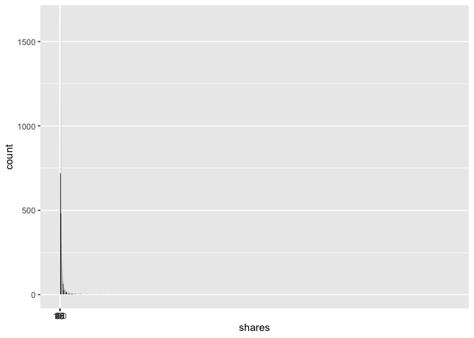
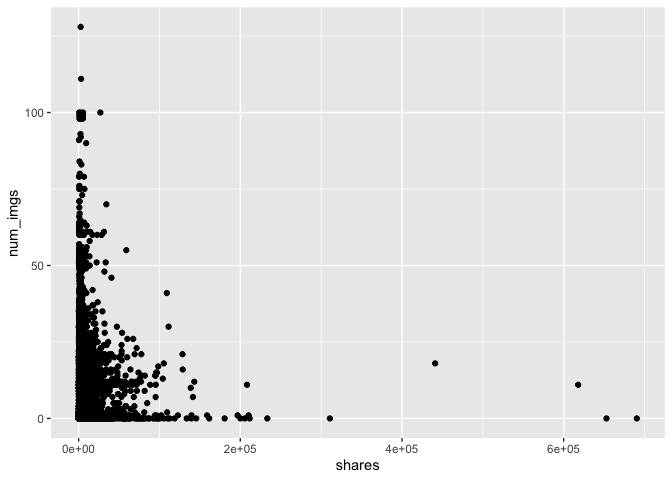

Project2McKeonSnyder
================
Owen Snyder
2022-07-05

-   [Introduction](#introduction)
    -   [Our Goal and Purpose](#our-goal-and-purpose)
    -   [Variable Selection](#variable-selection)
    -   [Methods](#methods)
    -   [Packages](#packages)
-   [Read in Data](#read-in-data)
-   [Create New Variables](#create-new-variables)
    -   [Filter Data by Channel](#filter-data-by-channel)
-   [Split Data: Train/Test Set](#split-data-traintest-set)
-   [Numerical Summaries](#numerical-summaries)
-   [Contingency Tables](#contingency-tables)
-   [Plots](#plots)
    -   [Plot 1 -](#plot-1--)
    -   [Plot 2 -](#plot-2--)
    -   [Plot 3 -](#plot-3--)
    -   [Plot 4 -](#plot-4--)
    -   [Plot 5 -](#plot-5--)
    -   [Plot 6 -](#plot-6--)
-   [Modeling](#modeling)
    -   [lm Model 1](#lm-model-1)
    -   [lm Model 2](#lm-model-2)
    -   [Ensemble 1](#ensemble-1)
    -   [Ensemble 2](#ensemble-2)
-   [Model Comparison???](#model-comparison)

Render Function

``` r
rmarkdown::render("Project2McKeonSnyder.Rmd",
                  output_format = "github_document",
                  output_file = "README.md",
                  output_options = list(
                    html_preview = FALSE, toc = TRUE, toc_depth = 2, toc_float = TRUE)
)
```

# Introduction

This is a full report of Project 2 conducted by Ashlee McKeon and Owen
Snyder.

## Our Goal and Purpose

The main goal of this project is to create predictive models based on
data from an [online news popularity
site](https://archive.ics.uci.edu/ml/datasets/Online+News+Popularity).
The data includes about two years worth of information regarding
*Mashable* articles. This data is summarized by a set of 61 categorical
and quantitative variables that will eventually help us predict the
number of shares a *Mashable* article gets. We will only use a subset of
these variables to help predict the shares variable using a variety of
predictive models such as Random Forrest and Boosted Tree models. A main
variable of interest will be the…

## Variable Selection

Because of the large variety of variables this data set includes, we
decided to only consider a subset of the variables to work with.
However, it is important to note one specific set of variables we will
be basing our analysis on. We will be starting with the
\*data_channel_is\_\*\* variables to see if they have any relation to
the number of shares and the rest of the variables we select.

The following our are variables of interest:

-   **shares** - Number of shares (this is our target variable!)
-   **n_tokens_title** - Number of words in the title
-   **average_token_length** - Average length of the words in the
    content
-   **global_rate_positive_words** - Rate of positive words in the
    content
-   **global_rate_negative_words** - Rate of negative words in the
    content
-   **num_imgs** - Number of images
-   **num_videos** - Number of videos
-   **num_hrefs** - Number of links

For categorical variables, we will be using the following varibles. In
fact, we will be combining the days of the week into one variable called
**dayOfWeek** and the method of its creation will be described as it
arises.

-   **weekday_is_monday** - Was the article published on a Monday?
-   **weekday_is_tuesday** - Was the article published on a Tuesday?
-   **weekday_is_wednesday** - Was the article published on a Wednesday?
-   **weekday_is_thursday** - Was the article published on a Thursday?
-   **weekday_is_friday** - Was the article published on a Friday?
-   **weekday_is_saturday** - Was the article published on a Saturday?
-   **weekday_is_sunday** - Was the article published on a Sunday?

Finally, the six data channels we will be working with come from these
key variables. Also, note that we have created one variable to represent
each data channel named **dataChannel**. Its method of creation will
also be described below as it arises.

-   **data_channel_is_lifestyle** - Is data channel ‘Lifestyle’?
-   **data_channel_is_entertainment** - Is data channel ‘Entertainment’?
-   **data_channel_is_bus** - Is data channel ‘Business’?
-   **data_channel_is_socmed** - Is data channel ‘Social Media’?
-   **data_channel_is_tech** - Is data channel ‘Tech’?
-   **data_channel_is_world** - Is data channel ‘World’?

## Methods

Before we get started, it is important to briefly describe the methods
wee used for analysis.

-   We will first read in the data set and manipulate the necessary
    variables.
-   The data will be separated into a training and test set. This will
    be a 70/30 split.
-   We will include some contingency tables at each setting of our
    categorical variables to get a better idea of the data at hand. We
    will also include summary statistics for quantitative variables. The
    data for these summaries will be used via the *training* data.
-   We will include a variety of graphs to better visualize our data.
    These graphs will be described in a more subjective manner so that
    automation of each setting of this report makes more sense. We will
    still be using the *training* data.
-   Finally, we will be using machine learning methods via Random
    Forrest Boosted Tree models. These models will be explained in
    greater detail in their respective section.

## Packages

Below is a list of necessary packages that will aid our data analysis
and modeling.

-   `tidyverse` is a collection of useful packages designed for data
    science.
-   `ggplot2` is an amazing way to create visually pleasing and
    informative graphics.
-   `caret` is a set of functions that streamline the process of
    implementing machine learning methods.
-   `rmarkdown` is a useful package for creating R Markdown documents in
    a variety of formats.
-   `knitr` is a useful package to integrate computing and reporting.

``` r
library(tidyverse)
library(ggplot2)
library(caret)
library(rmarkdown)
library(knitr)
```

# Read in Data

``` r
setwd("~/Desktop")
newsData <- read_csv("OnlineNewsPopularity.csv")
newsData
```

    ## # A tibble: 39,644 × 61
    ##    url          timedelta n_tokens_title n_tokens_content n_unique_tokens n_non_stop_words n_non_stop_uniq…
    ##    <chr>            <dbl>          <dbl>            <dbl>           <dbl>            <dbl>            <dbl>
    ##  1 http://mash…       731             12              219           0.664             1.00            0.815
    ##  2 http://mash…       731              9              255           0.605             1.00            0.792
    ##  3 http://mash…       731              9              211           0.575             1.00            0.664
    ##  4 http://mash…       731              9              531           0.504             1.00            0.666
    ##  5 http://mash…       731             13             1072           0.416             1.00            0.541
    ##  6 http://mash…       731             10              370           0.560             1.00            0.698
    ##  7 http://mash…       731              8              960           0.418             1.00            0.550
    ##  8 http://mash…       731             12              989           0.434             1.00            0.572
    ##  9 http://mash…       731             11               97           0.670             1.00            0.837
    ## 10 http://mash…       731             10              231           0.636             1.00            0.797
    ## # … with 39,634 more rows, and 54 more variables: num_hrefs <dbl>, num_self_hrefs <dbl>, num_imgs <dbl>,
    ## #   num_videos <dbl>, average_token_length <dbl>, num_keywords <dbl>, data_channel_is_lifestyle <dbl>,
    ## #   data_channel_is_entertainment <dbl>, data_channel_is_bus <dbl>, data_channel_is_socmed <dbl>,
    ## #   data_channel_is_tech <dbl>, data_channel_is_world <dbl>, kw_min_min <dbl>, kw_max_min <dbl>,
    ## #   kw_avg_min <dbl>, kw_min_max <dbl>, kw_max_max <dbl>, kw_avg_max <dbl>, kw_min_avg <dbl>,
    ## #   kw_max_avg <dbl>, kw_avg_avg <dbl>, self_reference_min_shares <dbl>, self_reference_max_shares <dbl>,
    ## #   self_reference_avg_sharess <dbl>, weekday_is_monday <dbl>, weekday_is_tuesday <dbl>, …

``` r
## change path
```

# Create New Variables

Because we are working with six different channels across six different
columns of data, we figured it would be easier to combine every channel
into one column. That way, we will be working with one single channel
variable that takes on unique values of Lifestyle, Entertainment,
Business, Social Media, Tech, and World. This will make automation and
analysis more clear. Note that the original data tells us that a data
for either channel is 1 or 0. meaning that 1 means “yes” and 0 means
“no”.

``` r
## use mutate() to create a new channel variable
newsData <- newsData %>% mutate(dataChannel = 
                              ifelse(data_channel_is_bus==1, "Business",
                              ifelse(data_channel_is_entertainment==1, "Entertainment",
                              ifelse(data_channel_is_lifestyle==1, "Lifestyle",
                              ifelse(data_channel_is_socmed==1, "Social Media",
                              ifelse(data_channel_is_tech==1, "Tech",
                              ifelse(data_channel_is_world==1, "World", "Other")))))))

## upon inspection, there are NA values present, this could be due to some articles not having
## one of these specific categories

#factor(newsData$dataChannel)

## convert to a factor for analysis??

#newsData

#summary(newsData)
```

## Filter Data by Channel

``` r
newsData.busn <- newsData %>% filter(dataChannel=="Business")
newsData.ent <- newsData %>% filter(dataChannel=="Entertainment")
newsData.life <- newsData %>% filter(dataChannel=="Lifestyle")
newsData.socmed <- newsData %>% filter(dataChannel=="Social Media")
newsData.tech <- newsData %>% filter(dataChannel=="Tech")
newsData.wrld <- newsData %>% filter(dataChannel=="World")


channel.data <- newsData %>% filter(dataChannel == params$dataChannel)
```

# Split Data: Train/Test Set

In this section we will split our newsData into a training and test set.
The training set will be used for model fitting and EDA while the test
set will be used for predictions (verify). This will be a 70/30 split.

NOTE: this will have to be re-ran due to the addition of the dayOfWeek
variable. process will be the same but will to re-run all data chunks.

NOTE: NEED TO REMOVE VARIABLES!! i.e the variables that are based on new
variables need to be deleted from data set.

``` r
set.seed(558) ## set seed for reproducibility
trainIndex <- createDataPartition(newsData$shares, p = 0.70, list = FALSE)
newsTrain <- newsData[trainIndex, ]
newsTest <- newsData[-trainIndex, ]
```

# Numerical Summaries

# Contingency Tables

# Plots

This section is dedicated to visualization by means of the `ggplot2`
package. (edit the toc headings below)

## Plot 1 -

## Plot 2 -

## Plot 3 -

## Plot 4 -

This is a histogram of the shares variable. We wanted to get a better
idea of how this response variable is distributed.

``` r
hist.shares <- ggplot(data = newsTrain, aes(x = shares))
hist.shares + geom_histogram(bins = 50, binwidth = 40) + scale_x_continuous(breaks = seq(0, 100, 5))
```

<!-- -->

``` r
#summary(newsTrain$shares)
#hist(newsTrain$shares)
```

## Plot 5 -

Next we will plot the number of images versus the number of shares. This
will be done via a scatterplot because this will be able to give us a
better visual of how these data are represented and if they are
associated with one another.

``` r
sp1 <- ggplot(data = newsTrain, aes(x = shares, y = num_imgs))
sp1 + geom_point()
```

<!-- -->

``` r
sp2 <- ggplot(data = newsTrain, aes(x = shares, y = num_hrefs))
sp2 + geom_point()
```

<!-- -->

## Plot 6 -

# Modeling

The main goal of our modeling section is to create predictive models for
predicting the number of shares based on our variables of interest. We
will be using two linear regression type models and two ensemble
tree-based models. Once these models are fit, we will be able to
identify the best of the four.

First, it is important to describe in detail the methods behind each of
these model types.

**Linear Models** – Ashlee describes …

**Ensemble Models** – Ashlee describes …

NOTE: i can also do this part if need be!

## lm Model 1

Owen **Full Linear Model** using all of our variables of interest.
explain in more detail.

``` r
## set up trainControl using 5-fold cross validation
trnCntrl <- trainControl(method = "cv", number=5)
## NewtrnCntrl for ENSEMBLE METHODS
NewtrnCntrl <- trainControl(method = "cv", number=5, repeats=3)
```

    ## Warning: `repeats` has no meaning for this resampling method.

``` r
## now fit linear model for all of our chosen predictors
lmFit1 <- train(shares ~ n_tokens_title + average_token_length + global_rate_positive_words +
                         global_rate_negative_words + num_imgs + num_videos + num_hrefs,
                data = newsTrain,
                method = "lm",
                trControl = trnCntrl)
##pre process


## Now predict on the TEST data!
lmFit1.pred <- predict(lmFit1, newdata = newsTest)
```

## lm Model 2

Ashlee

## Ensemble 1

Ashlee

## Ensemble 2

Owen **Boosted Tree Model**. This is a boosted tree model using all
variables we have selected for analysis as predictors.

``` r
gbmGrid <-  expand.grid(interaction.depth = c(1,2,3,4), 
                        n.trees = c(25,50,100,150,200), 
                        shrinkage = 0.1,
                        n.minobsinnode = 10)

boostFit <- train(shares ~ n_tokens_title + average_token_length + global_rate_positive_words +
                         global_rate_negative_words + num_imgs + num_videos + num_hrefs,
                  data = newsTrain,
                  method = "gbm",
                  trControl = NewtrnCntrl,
                  preProcess = c("center", "scale"),
                  tuneGrid = gbmGrid,
                  verbose = FALSE)
```

# Model Comparison???
